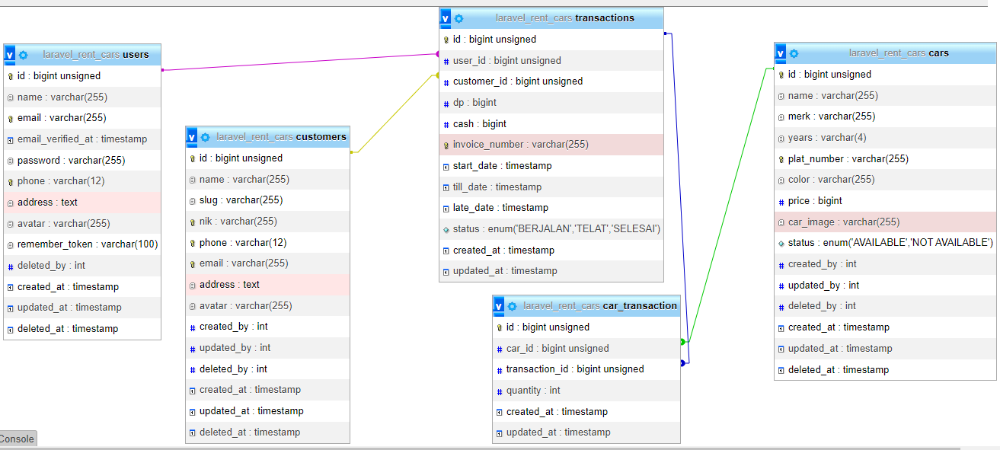

<p align="center">
  
</p>

# Laravel Car Rental Management Platform

This is a car rental management app platform I made mostly using Laravel ^7.24

| [Features][] | [Requirements][] | [Install][] | [How to setting][] | [DB Structure][] | [License][] |

## Features 
- |<h3>Menu  </h3>       |       Description                                                                  |
  |-----------------------|-----------------------------------------------------------------------------------|
  |<b>Dashboard           | </b>Contains information about all menu.                                          |
  |<b>Admin               | </b>Manage admin and employee roles.                                              |
  |<b>Customer            | </b>Manage about all customers.                                                   |
  |<b>Car                 | </b>Manage all type of the cars.                                                  |
  |<b>Transaction         | </b>Manage about all transactions.                                                |
  |<b>Profile             | </b>Edit user's profile and password.                                             |
- Car Rental Management Solution
- Open Source

## Requirements

	PHP = ^7.2
    laravel = ^7.2
    laravel-ui = ^2.4
    barryvdh/laravel-dompdf = ^2.0

## Install

Clone repo

```
git clone https://github.com/muhammadhabibfery/rent-cars.git
```

Install Composer


[Download Composer](https://getcomposer.org/download/)


composer update/install 

```
composer install
```

Install Nodejs


[Download Node.js](https://nodejs.org/en/download/)


NPM dependencies
```
npm install
```

Using Laravel Mix 

```
npm run dev
```

## How to setting 

Go into .env file change Database and Email credentials.

Run the migration

```
php artisan migrate
```

Or run the migration with seeder if you want seeding the related data

```
php artisan migrate --seed
```

Generate a New Application Key

```
php artisan key:generate
```

Create a symbolic link

```
php artisan storage:link
```

## Database Structure



## License

> Copyright (C) 2022 Muhammad Habib Fery.  
**[⬆ back to top](#laravel-car-rental-management-platform)**

[Features]:#features
[Requirements]:#requirements
[Install]:#install
[How to setting]:#how-to-setting
[DB Structure]:#database-structure
[License]:#license


<p align="center"><a href="https://laravel.com" target="_blank"></a></p>

<p align="center">
<a href="https://travis-ci.org/laravel/framework"></a>
<a href="https://packagist.org/packages/laravel/framework"></a>
<a href="https://packagist.org/packages/laravel/framework"></a>
<a href="https://packagist.org/packages/laravel/framework"></a>
</p>
